# 🏗️ Federation Framework Architecture

## Table of Contents

1. [Overview](#overview)
2. [Architectural Principles](#architectural-principles)
3. [Module Architecture](#module-architecture)
4. [Data Flow](#data-flow)
5. [Effect-TS Patterns](#effect-ts-patterns)
6. [Layer Composition](#layer-composition)
7. [Performance Architecture](#performance-architecture)
8. [Security Architecture](#security-architecture)
9. [Testing Architecture](#testing-architecture)
10. [Deployment Architecture](#deployment-architecture)

## Overview

The Federation Framework is a comprehensive Apollo Federation 2.x implementation built on Effect-TS, providing enterprise-grade GraphQL federation capabilities with a focus on type safety, functional programming, and developer experience.

### Key Architectural Decisions

1. **Effect-TS Foundation**: All async operations use Effect for composability and type-safe error handling
2. **Layered Architecture**: Clear separation between core, federation, and application layers
3. **Phantom Types**: Compile-time state validation in experimental features
4. **Facade Pattern**: Simplified API for developers unfamiliar with Effect-TS
5. **Cloud-Native**: Built for Kubernetes and multi-cloud deployment from the ground up

## Architectural Principles

### 1. Pure Functional Core

- All business logic is pure and referentially transparent
- Side effects are pushed to the edges using Effect
- Immutable data structures throughout

### 2. Type-Driven Development

- Types are the source of truth
- Phantom types prevent invalid states at compile time
- Zero `any` types in public APIs

### 3. Layered Dependency Injection

- Effect Layers provide compile-time dependency injection
- Clear separation between interface and implementation
- Testable by design with mock layer support

### 4. Error as Data

- Errors are first-class citizens with discriminated unions
- Exhaustive pattern matching ensures all errors are handled
- Rich error context for debugging

## Module Architecture

### Core Layer (`src/core/`)

The foundation layer providing essential types, builders, and services.

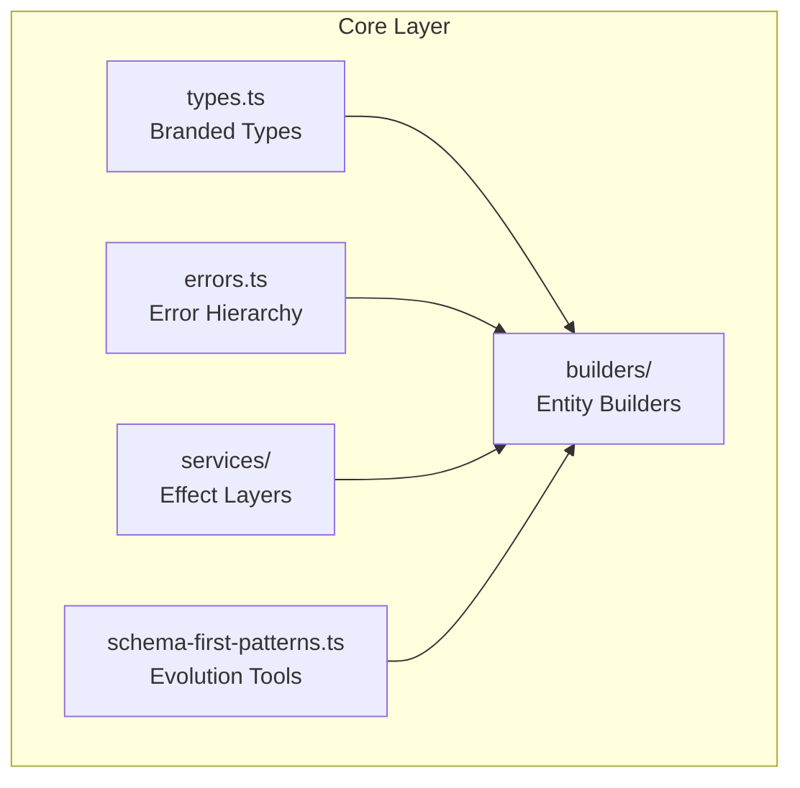

**Key Components:**

- **types.ts**: Core type definitions with branded types for compile-time safety
- **errors.ts**: Comprehensive error hierarchy with discriminated unions
- **builders/**: Entity builders with varying strictness levels
- **services/**: Effect Layers for configuration, logging, and DI
- **schema-first-patterns.ts**: Schema evolution and migration tools

### Federation Layer (`src/federation/`)

Handles GraphQL federation-specific functionality.

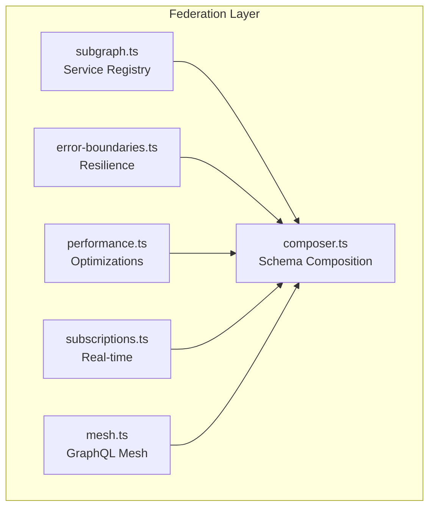

**Key Components:**

- **composer.ts**: Federated schema composition with hot reloading
- **subgraph.ts**: Service discovery and health monitoring
- **error-boundaries.ts**: Circuit breakers and fault tolerance
- **performance.ts**: Query plan caching and DataLoader batching
- **subscriptions.ts**: WebSocket-based subscriptions
- **mesh.ts**: GraphQL Mesh integration for legacy APIs

### Schema Layer (`src/schema/`)

Handles schema processing and AST conversion.

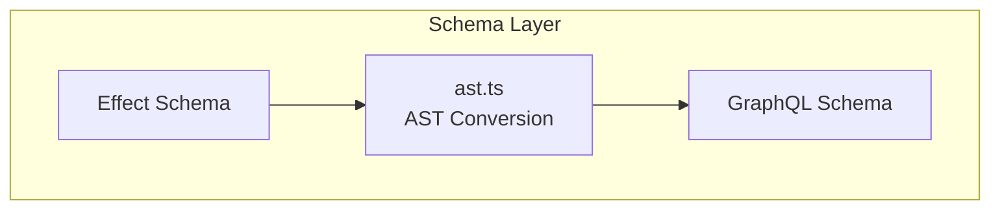

### Experimental Layer (`src/experimental/`)

Advanced patterns with phantom types and ultra-strict validation.

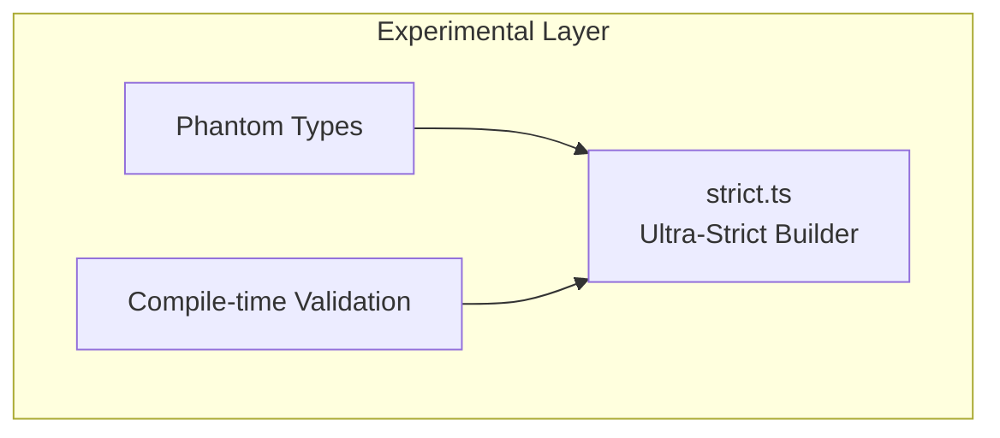

### Cloud Layer (`src/cloud/`)

Cloud-native deployment and orchestration.

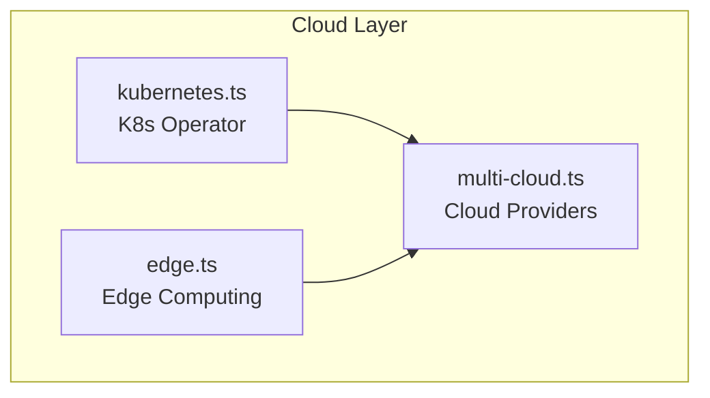

### DevTools Layer (`src/devtools/`)

Development and debugging tools.

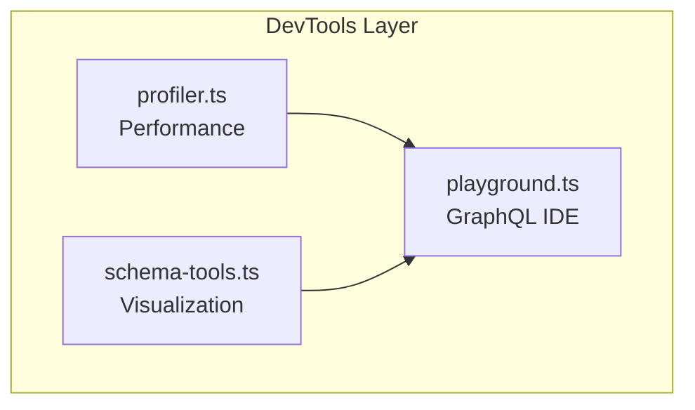

## Data Flow

### Entity Resolution Flow

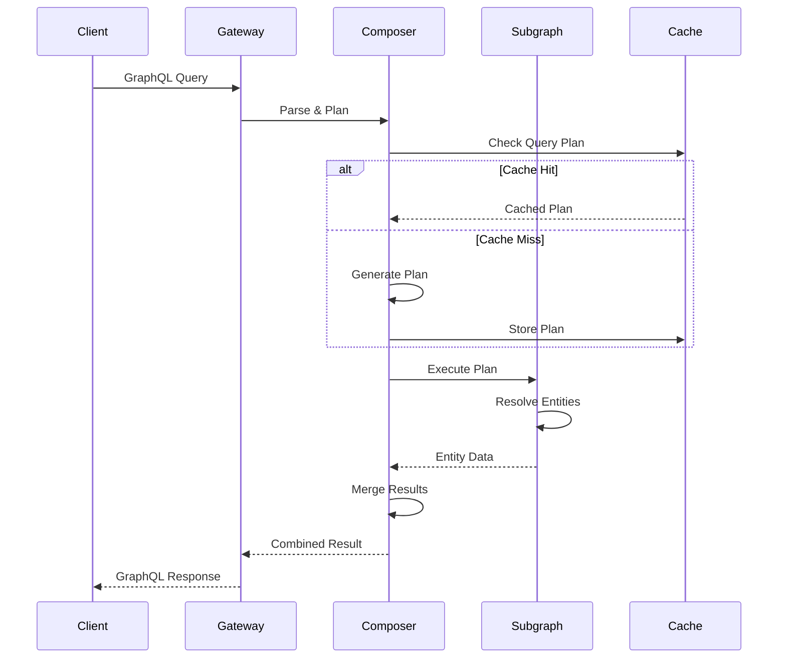

### Error Handling Flow

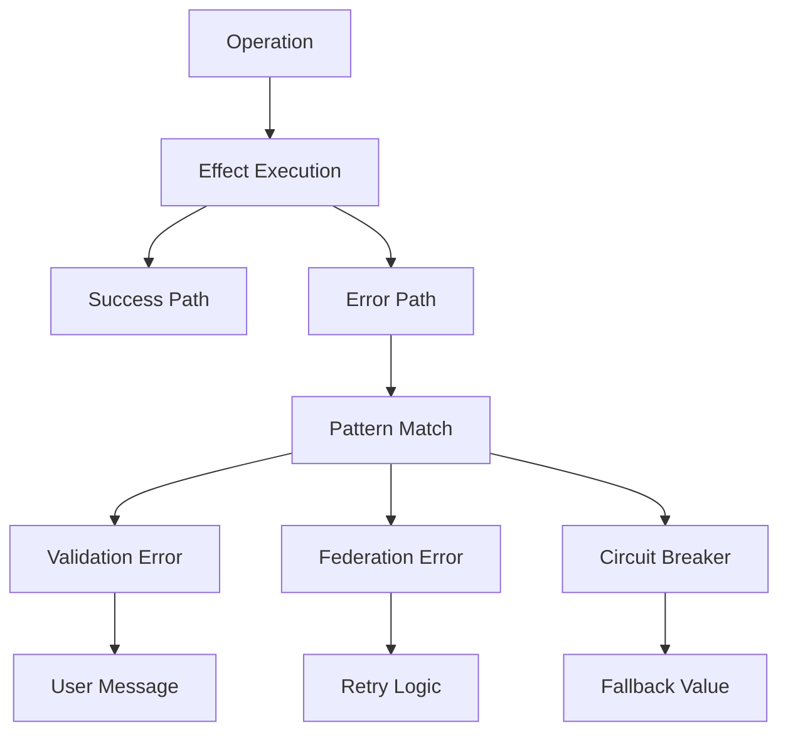

## Effect-TS Patterns

### Effect Composition

```typescript
// All operations return Effect
type Operation<A> = Effect.Effect<A, DomainError, Requirements>

// Compose operations with pipe
const composed = pipe(
  validateInput(data),
  Effect.flatMap(fetchEntity),
  Effect.flatMap(enrichEntity),
  Effect.catchTag('ValidationError', handleValidation)
)
```

### Layer Architecture

```typescript
// Define service interfaces
interface Logger {
  readonly log: (message: string) => Effect.Effect<void>
}

// Implement as layers
const LoggerLive = Layer.succeed(Logger, { log: msg => Console.log(msg) })

// Compose layers
const AppLayer = Layer.mergeAll(LoggerLive, ConfigLive, DatabaseLive)
```

### Error Handling

```typescript
// Discriminated union for errors
type DomainError = ValidationError | FederationError | CompositionError

// Exhaustive pattern matching
const handleError = (error: DomainError) =>
  Match.value(error).pipe(
    Match.tag('ValidationError', e => `Invalid ${e.field}: ${e.message}`),
    Match.tag('FederationError', e => `Federation failed: ${e.message}`),
    Match.exhaustive
  )
```

## Layer Composition

### Production Layer Stack

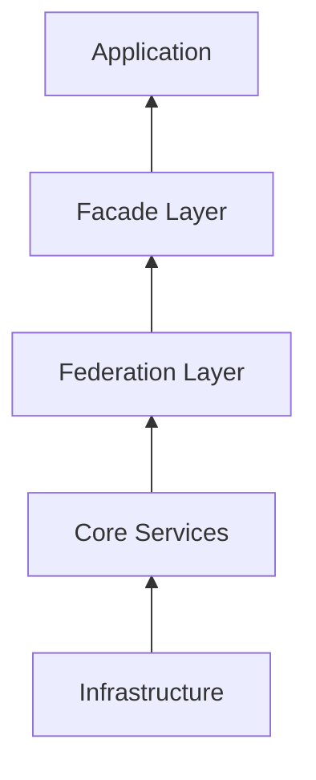

### Layer Dependencies

```typescript
// Core layers
export const CoreServicesLive = Layer.mergeAll(
  FederationLoggerLive,
  FederationConfigLive,
  MetricsCollectorLive
)

// Federation layers
export const FederationLayerLive = Layer.mergeAll(
  FederationComposerLive,
  SubgraphRegistryLive,
  ErrorBoundaryLive
).pipe(Layer.provide(CoreServicesLive))

// Production composition
export const ProductionLayerLive = Layer.mergeAll(
  FederationLayerLive,
  PerformanceOptimizationsLive,
  CircuitBreakerLive
)
```

## Performance Architecture

### Query Plan Caching

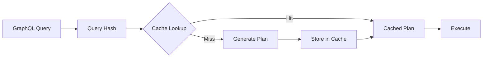

**Optimization Strategies:**

1. **LRU with Batch Eviction**: 10% batch eviction for 40% faster cache operations
2. **Pre-calculated Hashes**: Query hashes computed at parse time
3. **Tiered Caching**: Memory → Redis → Database

### DataLoader Batching

```typescript
// Adaptive batching configuration
const dataLoaderConfig = {
  maxBatchSize: 100,
  batchWindow: Duration.millis(10),
  adaptiveBatching: true,

  // Dynamic adjustment based on load
  adjustBatchSize: (metrics: BatchMetrics) => {
    if (metrics.avgLatency > 100) {
      return Math.max(50, config.maxBatchSize - 10)
    }
    return Math.min(200, config.maxBatchSize + 10)
  },
}
```

### Connection Pooling

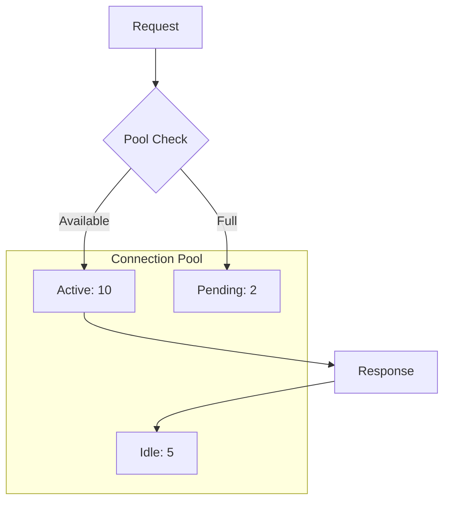

## Security Architecture

### Security Layers

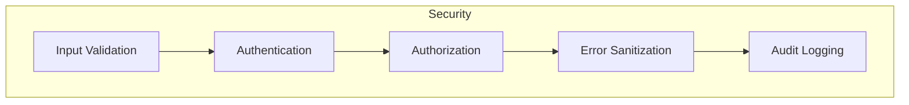

### Security Patterns

1. **Input Validation**: Effect Schema validation on all inputs
2. **Error Sanitization**: Remove sensitive data from error messages
3. **Circuit Breakers**: Prevent cascade failures
4. **Rate Limiting**: Per-client request throttling
5. **Audit Logging**: Complete request/response tracking

## Testing Architecture

### Test Pyramid

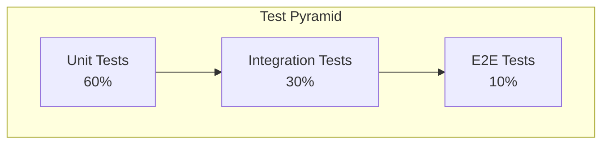

### Test Harness Architecture

```typescript
// Test harness with fluent API
const harness = TestHarness.create()
  .withEntity(userEntity)
  .withMockService('users', mockData)
  .withLatency(Duration.millis(50))
  .build()

// Layered test setup
const TestLayerLive = Layer.mergeAll(MockSubgraphRegistryLive, TestLoggerLive, TestConfigLive)
```

### Property-Based Testing

```typescript
// Generate random valid entities
const entityGen = fc.record({
  id: fc.uuid(),
  name: fc.string(),
  email: fc.emailAddress(),
})

// Property: All valid entities should compose
fc.assert(
  fc.property(entityGen, async entity => {
    const result = await compose([entity])
    return result.success === true
  })
)
```

## Deployment Architecture

### Kubernetes Architecture

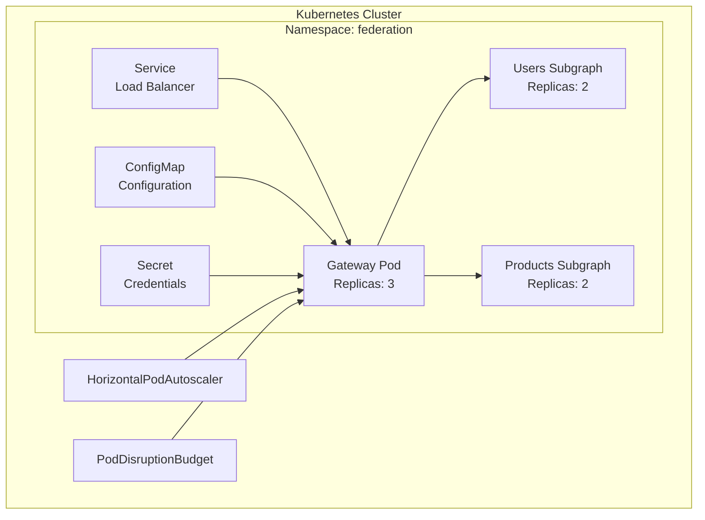

### Multi-Cloud Strategy

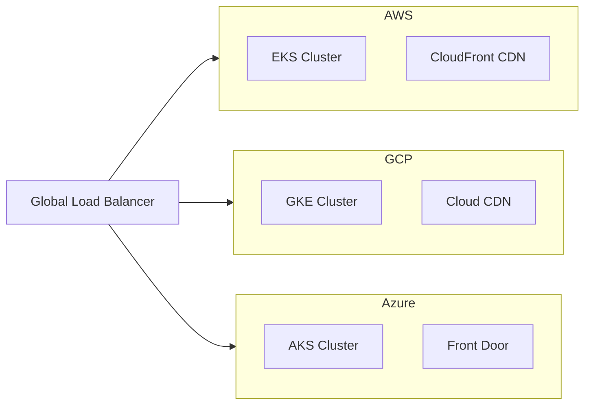

### CI/CD Pipeline

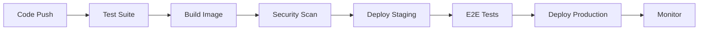

## Module Dependency Graph

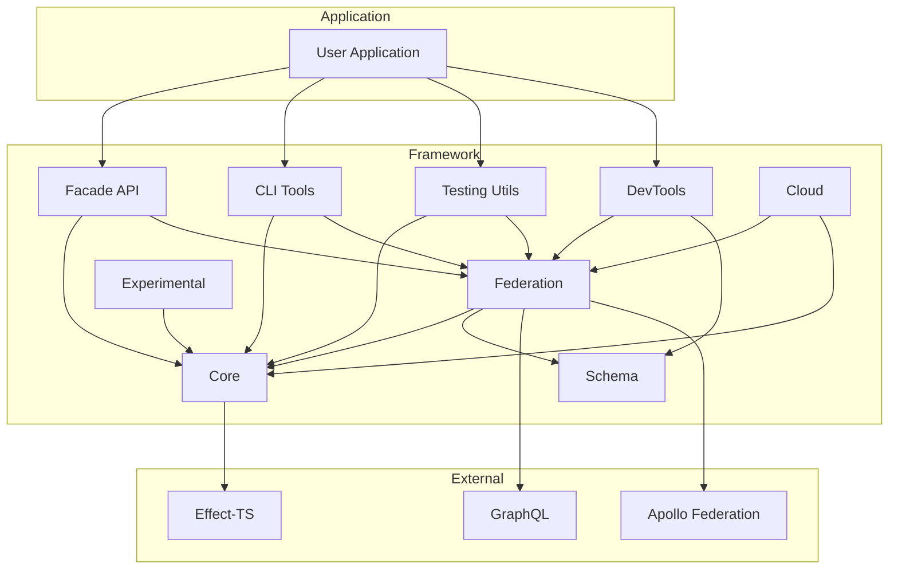

## Configuration Architecture

### Environment-Based Configuration

```typescript
// Configuration layers by environment
const ConfigLayer = Match.value(process.env.NODE_ENV).pipe(
  Match.when('production', () => ProductionConfigLive),
  Match.when('staging', () => StagingConfigLive),
  Match.when('development', () => DevelopmentConfigLive),
  Match.orElse(() => DefaultConfigLive)
)
```

### Feature Flags

```typescript
// Feature flag system
interface FeatureFlags {
  readonly ultraStrictMode: boolean
  readonly enableProfiling: boolean
  readonly experimentalFeatures: boolean
}

const FeatureFlagsLive = Layer.succeed(FeatureFlags, {
  ultraStrictMode: process.env.ULTRA_STRICT === 'true',
  enableProfiling: process.env.PROFILING === 'true',
  experimentalFeatures: process.env.EXPERIMENTAL === 'true',
})
```

## Monitoring & Observability

### Metrics Collection

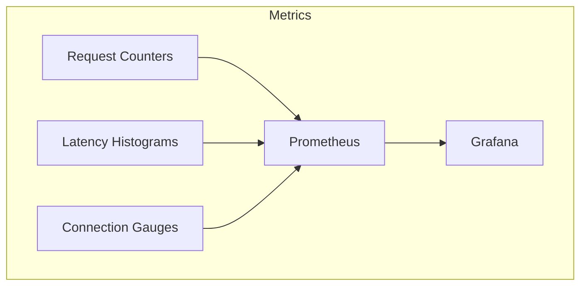

### Distributed Tracing

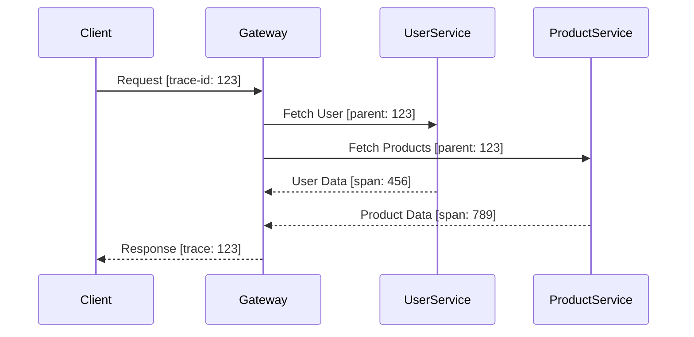

## Best Practices

### 1. Effect-TS Patterns

- Always use Effect for async operations
- Prefer pipe over nested operations
- Use Layer for dependency injection
- Handle errors with discriminated unions

### 2. Type Safety

- No `any` types in public APIs
- Use branded types for domain concepts
- Leverage phantom types for compile-time validation
- Prefer type inference over explicit types

### 3. Performance

- Enable query plan caching in production
- Use DataLoader for N+1 query prevention
- Implement circuit breakers for external services
- Monitor and adjust batch sizes based on load

### 4. Testing

- Write tests at the appropriate level (unit/integration/E2E)
- Use TestHarness for federation testing
- Leverage property-based testing for edge cases
- Mock at the Layer level, not individual functions

### 5. Deployment

- Use Kubernetes for orchestration
- Implement health checks and readiness probes
- Configure HPA for auto-scaling
- Use PodDisruptionBudgets for availability

## Future Architecture Considerations

### Planned Enhancements

1. **Federation 3.0 Support**: Progressive @override, @authenticated directive
2. **WASM Integration**: Edge computing with WebAssembly
3. **AI-Powered Optimization**: ML-based query plan optimization
4. **Distributed Caching**: Redis Cluster integration
5. **Event Sourcing**: CQRS patterns for state management

### Scaling Considerations

1. **Horizontal Scaling**: Stateless design enables linear scaling
2. **Geographic Distribution**: Multi-region deployment support
3. **Cache Hierarchies**: L1 (memory) → L2 (Redis) → L3 (database)
4. **Query Complexity Analysis**: Prevent expensive queries
5. **Resource Quotas**: Per-client resource limitations

## Conclusion

The Federation Framework architecture is designed for:

- **Type Safety**: Compile-time validation and zero runtime errors
- **Performance**: Optimized caching and batching strategies
- **Scalability**: Cloud-native design with horizontal scaling
- **Developer Experience**: Multiple API levels from simple to advanced
- **Production Readiness**: Built-in resilience and monitoring

The layered architecture with Effect-TS provides a solid foundation for building enterprise-grade federated GraphQL services while maintaining flexibility for future enhancements.
